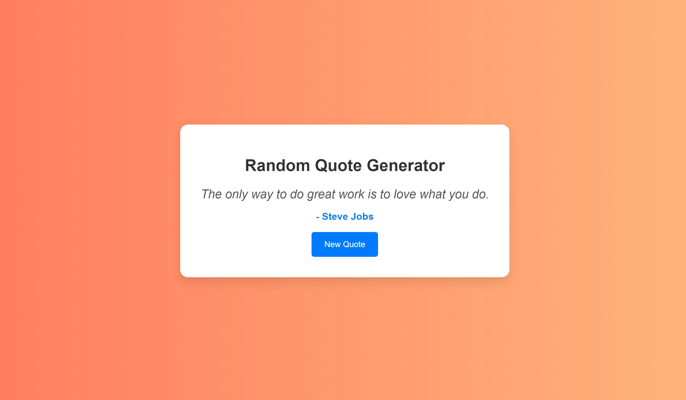

# Random Quote Generator

A simple and visually appealing Random Quote Generator built with HTML, CSS, and JavaScript. This application displays a random quote each time the "New Quote" button is pressed.

## Features

- Display a random quote on button click
- Visually appealing and responsive design
- Easy to use and extend with more quotes

## How to Use

1. **Get a New Quote**:
   - Press the "New Quote" button to display a new random quote.
   
2. **View the Quote**:
   - The displayed quote will appear in the quote container along with the author's name.

## Project Structure

- **index.html**: The main HTML file containing the structure of the application.
- **style.css**: The CSS file for styling the application.
- **script.js**: The JavaScript file for the application logic.

